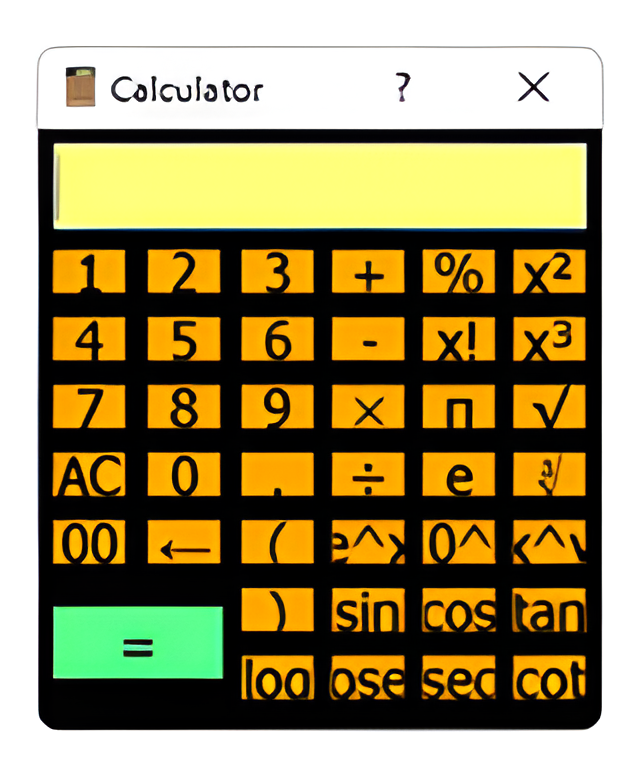

# Calculator:

A simple calculator GUI app in Python and PyQt5.

## Screenshots:

<p align="center">
  
</p>


## 📦 Tech Stack:

- [Python](https://www.python.org/) - Python is a high-level, general-purpose programming language.
- [PyQt5](https://www.riverbankcomputing.com/static/Docs/PyQt5/)  - A comprehensive set of Python bindings for Qt v5.

## Getting Started: 

- Clone Repo 

```bash
cd /path/to/folder
mkdir calculator
cd calculator
git clone https://github.com/Arvind-4/Calculator-In-PyQt5.git .
```  

- Create a Virtual Environment

```bash
cd calculator
python3.9 -m venv .
source bin/activate
```

**For Windows use:** `.\Scripts\activate`

- Install Dependencies

```bash
pip install -r requirements.txt
```


- Run the App

```bash
python src/main.py
```
